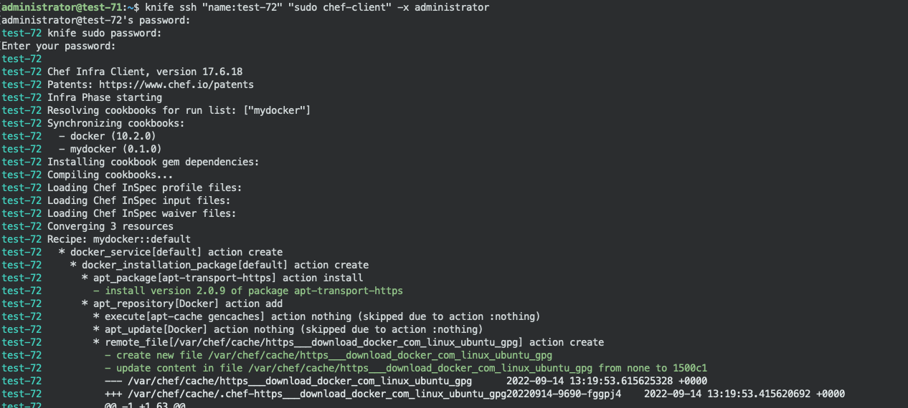
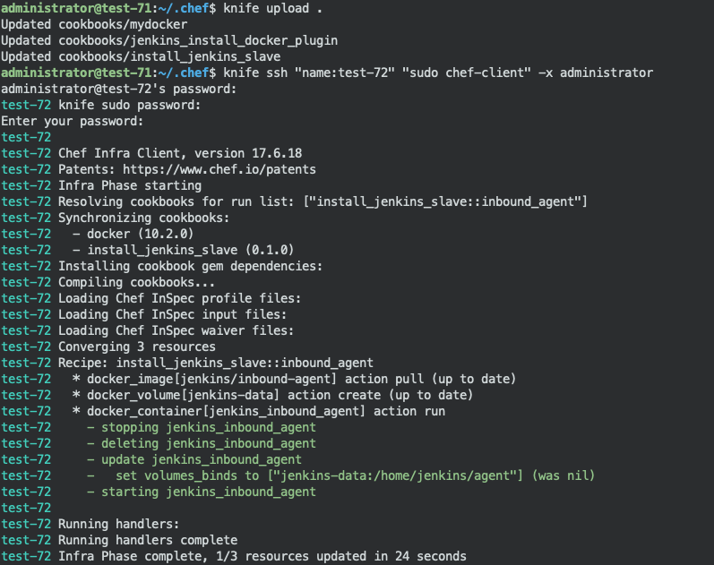
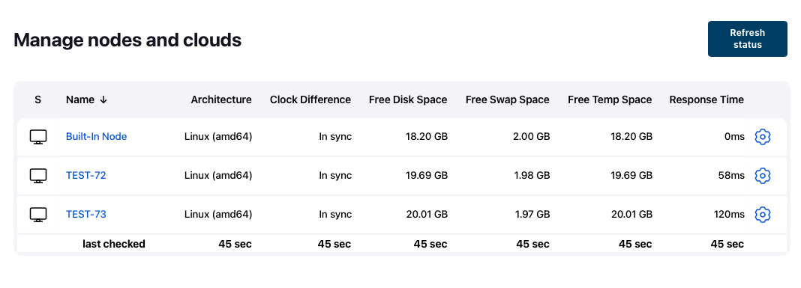

# INSTALL CHEF WORKSTATION AND SERVER CORE

Used to doing automation process which a master node can be used to configure, installing and deploying services to selected node.

---

## SETTING UP CHEF SERVER CORE AND WORKSTATION FOR MASTER NODE

Get the right package from official source

1. Download chef workstation package
    ```  
    wget https://packages.chef.io/files/stable/chef-workstation/21.10.640/ubuntu/20.04/chef-workstation_21.10.640-1_amd64.deb
    ```
2. Download chef server core package
    ```   
    wget https://packages.chef.io/files/stable/chef-server/15.1.7/ubuntu/20.04/chef-server-core_15.1.7-1_amd64.deb
    ```
3. Install all packages by using following command
```   
    sudo dpkg -i *.deb
```
4. run following command to configure chef server
```
    sudo chef-server-ctl reconfigure
    sudo chef-server-ctl user-create administrator admin aja administrator@localhost.local 'PasswordHere' --filename ~/administrator.pem
    sudo chef-server-ctl org-create panicscript 'Panicscript Test' --association_user administrator --filename ~/panicscript-validator.pem
```

5. You must setup knife and provide value with the following command and then copy user credential into /home/username/.chef/username.pem
```
    knife configure
    cp ~/*.pem ~/.chef/
    chmod 755 ~/.chef/*.pem
    knife ssl fetch
```

---

## WORKING WITH COOKBOOKS AND REPOSITORIES


1. initialize directory .chef/cookbooks in user home as a git repository and provide identity owner for this local repo
    ```
    cd ~/.chef/cookbooks
    git config --global user.email "user@email.com"
    git config --global user.name "username"
    git init
    git add .
    git commit -a -m 'first commit'
    ```
2. run command using knife to download docker cookbook from server (https://supermarket.chef.io/cookbooks/docker)
    ```
    knife supermarket download docker
    knife supermarket install docker
    ```
3. Make new recipe at ~/.chef/cookbooks
    ```
    cd ~/.chef/cookbooks
    chef generate cookbook mydocker
    ```
4. Edit metadata.rb and add following line to the bottom of metadata.rb file
    ```
    depends 'docker'
    ```
5. Edit file on mydocker/recipe/default.rb and add this 
    ```
    docker_service 'default' do
        action [:create, :start]
    end

    docker_image 'busybox' do
        action :pull
    end

    docker_container 'an-echo-server' do
        repo 'busybox'
        port '1234:1234'
        command "nc -ll -p 1234 -e /bin/cat"
    end
    ```
6. Upload cookbook to chef server repository ('mydocker' recipe) and its dependencies
    ```
    knife cookbook upload cookbookName
    ```
7. The final file can be accessed at this [link](./cookbooks/mydocker/)
---

## SETUP CHEF NODES (FROM CHEF MANAGER/MASTER) AND INSTALL DOCKER TO ALL NODE

Before we can adding node, we should install chef workstation om each node

    ```
    wget https://packages.chef.io/files/stable/chef-workstation/21.10.640/ubuntu/20.04/chef-workstation_21.10.640-1_amd64.deb 
    sudo dpkg -i *.deb
    ```

1. From chef master add all node ip addresses into /etc/hosts
    ```
    sudo nano /etc/hosts
    ```
2. From master/manager nodes run the following command to add all nodes into chef master:
    ```
    knife bootstrap 172.18.100.72 -U administrator -P 'PasswordUsed' --use-sudo-password --sudo --node-name test-72
    ```
3. Check newly added nodes
    ```
    knife client list
    ```
4. Add install list to nodes (in this case for installing docker with recipe mydocker to all nodes including master):
    ```
    knife node run_list add test-72 "recipe[mydocker]"
    ```
5. Install docker by using mydocker recipe to chef nodes (with user administrator)
    ```
    knife ssh "name:test-72" "sudo chef-client" -x administrator
    ```



---

## SETUP JENKINS DOCKER PLUGIN USING CHEF

A. Install Docker Plugin For Jenkins

1. Go to chef repository (~/.chef/cookbooks) and Install jenkins recipe from supermarket
    ```    
    cd ~/.chef/cookbooks
    knife supermarket install jenkins
    knife supermarket install dpkg_autostart
    knife supermarket install yum-epel
    ```
2. Make new recipe (in this case jenkins_install_docker_plugin) and enter it
    ```
    chef generate cookbook jenkins_install_docker_plugin
    cd jenkins_install_docker_plugin
    ```
3. Open metadata.rb and add following line
    ```
    depends 'docker'
    ```
4. Edit file recipe/default.rb, add the following lines and save it
    ```
    jenkins_plugin 'docker-plugin'
    jenkins_command 'safe-restart'
    ```
5. Upload all required cookbooks to chef server
    ```
    knife cookbook upload jenkins_install_docker_plugin
    ```
6. Add local server into chef master node:
    ```   
    knife bootstrap 172.18.100.71 -U administrator -P 'PasswordUsed' --use-sudo-password --sudo --node-name master-chef
    ```
7. Add install list recipe to master node:
    ```
    knife node run_list add master-chef "recipe[jenkins_install_docker_plugin]"
    ```
8. Execute install list within cookbooks repository (with user administrator and master node)
    ```
    knife ssh "name:master-chef" "sudo chef-client" -x administrator
    ```
    
B. Enable Docker plugin from jenkins dashboard and restart jenkins service
    ```
    sudo systemctl restart jenkins
    ```
---

## INSTALLING DOCKER BASED JENKINS SLAVE CONTAINER

A. Adding each slave node into jenkins

1. Login into jenkins dashboard
2. Move towards Manage jenkins > manage nodes and cloud
3. Add new node and fill the name field and click create
4. Fill required field
5. On field launch method choose "launch agent by connecting it to the controller"
6. Tick use socket
7. Save the configuration
8. Click on the newly created node and write down the secret key that will be used for creating jenkins agent container
9. Ensure all ports used by agent available to get jenkins agent connected into controller. Click Manage Jenkins > Configure global security

B. Create cookbook and recipe

1. Create new recipe using chef
    ```
    chef generate cookbook install_jenkins_slave
    ```
2. Open metadata.rb
    ```
    nano ~/.chef/cookbook/install_jenkins_slave/metadata.rb
    ```    
3. Add the following line
    ```
    depends 'docker'
    ```
4. Create 2 new recipes file to create jenkins agent container in each slave node
    ```
    touch ~/.chef/cookbook/install_jenkins_slave/recipes/inbound_agent.rb
    touch ~/.chef/cookbook/install_jenkins_slave/recipes/inbound_agent_2.rb
    ```
5. Edit that file and add the following lines
    ```
    ## pull new image
    docker_image 'jenkins/inbound-agent' do
        tag 'latest'
        action :pull
        notifies :redeploy, 'docker_container[jenkins_inbound_agent]'
    end

    # ## create volume
    docker_volume 'jenkins-data' do
    action :create
    end

    ## create container
    docker_container 'jenkins_inbound_agent' do

        repo 'jenkins/inbound-agent'
        detach true
        env ['JENKINS_URL=http://172.18.100.71:8080', 'JENKINS_AGENT_NAME=TEST-72', 'JENKINS_AGENT_WORKDIR=/home/jenkins/agents', 'JENKINS_SECRET=5aa06d66c3b580880eed1033687d6b487da599952f91cdc165a21dd0879e1d6e']
        volumes ['jenkins-data:/home/jenkins/agent']

    end
    ```
6. Change the environment variable especially JENKINS_URL, JENKINS_AGENT_NAME and JENKINS_SECRET with value from step A number 8. Other optional environment can be found from https://hub.docker.com/r/jenkins/inbound-agent/

7. Upload all required cookbooks to chef server repository
    ```
    knife cookbook upload cookbookNameHere
    ```
    Or you can run `knife upload .` to uploading all cookbook inside repo

8. Add install list recipe to slave nodes
    ```
    knife node run_list add test-72 "recipe[install_jenkins_slave::inbound_agent]"
    knife node run_list add test-73 "recipe[install_jenkins_slave::inbound_agent_2]"
    ```
9. Execute install list within cookbooks repository (with user administrator and slave node name)
    ```
    knife ssh "name:test-72" "sudo chef-client" -x administrator
    knife ssh "name:test-73" "sudo chef-client" -x administrator
    ```
    
10. Ensure all nodes connected to jenkins controller/master
    
11. Or checking docker container from each nodes
    ```
    docker container ls -a
    ```
