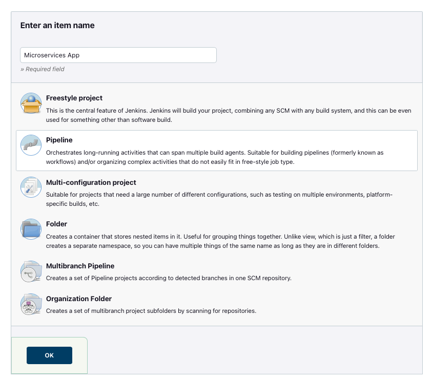
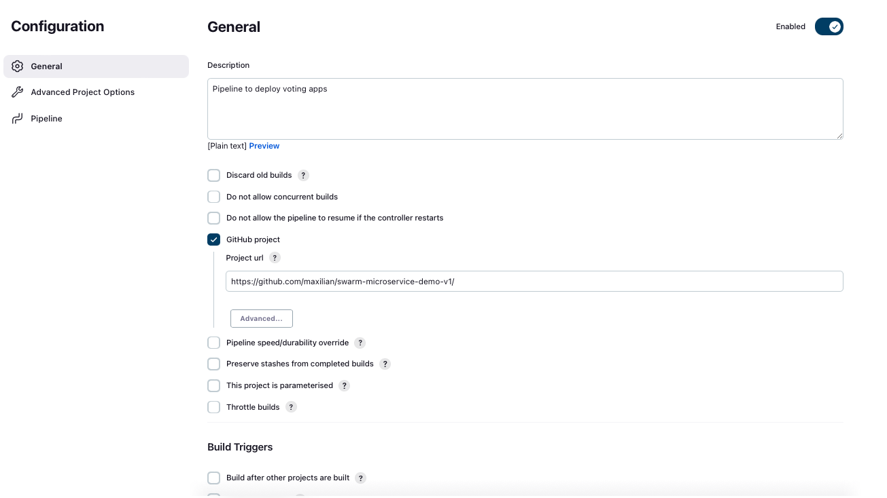
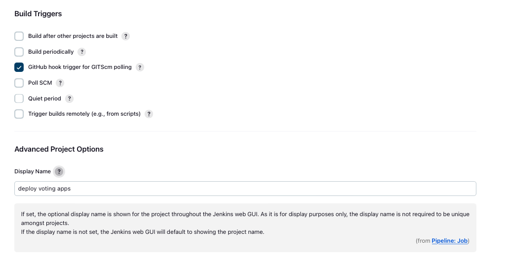

# JENKINS PIPELINE

## What is jenkins pipeline?

Pipeline is a collection of jobs or squences to brings software from Git repository into user hands by using automation process as soon as the code is commited to the repository. The pipeline can be used for build, testing, or deploying the software with certain scenario. In order to do automation process a jenkinsfile needs to be present at the project's root repository or from pipeline cofiguration on jenkins settings.

## Setting up docker cluster and required plugin for jenkins
1. Install Docker swarm plugin from jenkins dashboard and then restart the service
2. Setting up Docker swarm on master node
    ```
    docker swarm init
    ```
3. Joining slave node to master node
    ```
    docker swarm join --token SWMTKN-1-4eefnsaiqlz22qkggon0yhbufal51igek5lh3jtulc7jfntdfe-e56pzqo79fv03m7wvm7zh6gc4 172.18.100.71:2377
    ```
4. Edit file /etc/docker/daemon.json and restart docker service on all
    * daemon.json for master node
    ```
    {
        "insecure-registries" : ["localhost:5000", "127.0.0.1:5000", "172.18.100.71:5000"]

    }
    ```

    restart docker service
    ```
    sudo systemctl restart docker
    ```

5. Add jenkins user to docker group and restart jenkins (this step will allows jenkins to run docker)
    ```
    sudo usermod -a -G docker jenkins
    sudo systemctl restart jenkins
    ```
6. Deploy registry2 to hold docker image repository
    ```
    docker run -d -p 5000:5000 --restart=always --name registry registry:2
    ```
4. Fork repo from https://github.com/docker-archive/swarm-microservice-demo-v1, so we can make some changes on configuration file within our repo. [forked repo](https://github.com/maxilian/swarm-microservice-demo-v1)

## Getting ready to build docker images required by voting apps
1. Update some files in order to avoid deprecated dependencies such as changing java 7 to java 8 or above. [[reference](https://stackoverflow.com/questions/50824789/why-am-i-getting-received-fatal-alert-protocol-version-or-peer-not-authentic)]

    * [vote-worker/Dockerfile](https://github.com/maxilian/swarm-microservice-demo-v1/blob/master/vote-worker/Dockerfile)
    ```
    FROM openjdk:11

    RUN apt-get update -qq && apt-get install -y maven && apt-get clean

    WORKDIR /code

    ADD pom.xml /code/pom.xml
    RUN ["mvn", "dependency:resolve"]
    RUN ["mvn", "verify"]

    # Adding source, compile and package into a fat jar
    ADD src /code/src
    RUN ["mvn", "package"]

    CMD ["/usr/lib/jvm/java-11-openjdk-amd64/bin/java", "-jar", "target/worker-jar-with-dependencies.jar"]
    ```

    * [results-app/Dockerfile](https://github.com/maxilian/swarm-microservice-demo-v1/blob/master/results-app/Dockerfile)
    ```
    FROM node:5.1.1-slim

    RUN mkdir /app
    WORKDIR /app

    ADD package.json /app/package.json
    RUN npm install && npm ls
    RUN mv /app/node_modules /node_modules

    ADD . /app

    ENV PORT 80
    EXPOSE 80

    CMD ["node", "server.js"]

    ```
    * [results-app/package.json](https://github.com/maxilian/swarm-microservice-demo-v1/blob/master/results-app/package.json)
    ```
    {
        "name": "result-app",
        "version": "1.0.0",
        "description": "",
        "main": "server.js",
        "scripts": {
            "test": "echo \"Error: no test specified\" && exit 1"
        },
        "author": "",
        "license": "MIT",
        "dependencies": {
            "body-parser": "^1.14.1",
            "cookie-parser": "^1.4.0",
            "express": "^4.13.3",
            "method-override": "^2.3.5",
            "async": "^1.5.0",
            "pg": "^5.0",
            "socket.io": "^1.3.7"
        }
    }
    ```
2. Make new pipeline for build and deploy apps.

    * Click new item from Jenkins Dashboard fill the name and select pipeline before clicking OK.
    
    * Fill description, tick github checkbox and then fill with forked repo url `https://github.com/maxilian/swarm-microservice-demo-v1`
    
    * in Build Triggers section tick `GitHub hook trigger for GITScm polling`
     

2. Build docker image for vote-worker
    ```
    cd vote-worker
    docker build -t 172.18.100.71:5000/voteapps/vote-worker:latest
    docker push 172.18.100.71:5000/voteapps/vote-worker:latest
    ```
3. Build docker image for results-app
    ```
    cd ../results-app
    docker build -t 172.18.100.71:5000/voteapps/results-app:latest
    docker push 172.18.100.71:5000/voteapps/results-app:latest
    ```
4. Build docker image for web-vote-app
    ```
    cd ../web-vote-app
    docker build -t 172.18.100.71:5000/voteapps/web-vote-app:latest
    docker push 172.18.100.71:5000/voteapps/web-vote-app:latest
    ```
5. After we build all required docker images for this voting apps, in summary we will use this images for thex next step:
    * 172.18.100.71:5000/voteapps/vote-worker
    * 172.18.100.71:5000/voteapps/results-app
    * 172.18.100.71:5000/voteapps/web-vote-app
    * redis:3 
    * postgre:9.1


## Preparing Jenkins Pipeline File

We have 3 docker servers which join docker swarm that consist of 1 node manager (test-71) and 2 worker nodes (test-72 and test-73).  

1. We will deploy a combination of web-vote-app (accessible from port 4000) and 2 redis to worker node. Since we cannot expose the same ports from two or more services (that's how clustered environment works and docker too) for redis container we will not expose port to public. Jenkinsfile snippet:
    ```
        stage("Deploy web-vote-app and redis to worker node")
        {
            steps {
                sh '''
                    ls -al
                    if [ ! "$(docker service ps redis01)" ]; then
                        docker service create \
                        --name redis01 \
                        --network test-network \
                        --replicas 2 \
                        --publish 6379:6379 \
                        --constraint node.hostname!=test-71 \
                        --detach redis:3
                    else 
                        docker service update \
                        --replicas 2 \
                        --publish-add 6379:6379 \
                        --image redis:3 \
                        --constraint node.hostname!=test-71 \
                        --detach redis01
                    fi
                    
                    if [ ! "$(docker service ps redis02)" ]; then
                        docker service create \
                        --name redis02 \
                        --network test-network \
                        --replicas 1 \
                        --constraint node.hostname!=test-71 \
                        --detach redis:3
                    else 
                        docker service update \
                        --replicas 1 \
                        --constraint-add node.hostname!=test-71 \
                        --image redis:3 \
                        --detach redis02
                    fi

                    if [ ! "$(docker service ps frontend01)" ]; then
                       docker service create \
                        --name frontend01 \
                        --network test-network \
                        --replicas 2 \
                        --publish 4000:80 \
                        --env WEB_VOTE_NUMBER='01' \
                        --constraint node.hostname!=test-71 \
                        --detach 172.18.100.71:5000/voteapps/web-vote-app:latest
                    else 
                       docker service update \
                        --replicas 2 \
                        --publish-add 4000:80 \
                        --env-add WEB_VOTE_NUMBER='01' \
                        --image 172.18.100.71:5000/voteapps/web-vote-app:latest \
                        --constraint node.hostname!=test-71 \
                        --detach frontend01
                    fi
                    
                '''
            }
        }


    ```

2. The next step we will deploy results-app (port 8089), postgresql, and vote-worker to node test-71. Jenkinsfile snippet:
    ```
    stage("Deploy postgresql as DB") {

        steps {
            sh '''
            if [ ! "$(docker service ps store)" ]; then
                docker service create \
                --constraint node.hostname==test-71 \
                --name store \
                --env POSTGRES_PASSWORD=pg8675309 \
                --network test-network  \
                --publish 5432:5432 \
                --detach postgres:9.1
            else
                docker service rm store
                docker service create \
                --constraint node.hostname==test-71 \
                --name store \
                --env POSTGRES_PASSWORD=pg8675309 \
                --network test-network  \
                --publish 5432:5432 \
                --detach postgres:9.1
            fi
            '''
        }
    }
    ```

3. Jenkinsfile for this project will be like this [link](./jenkinsfile)
4. To check all container is running well, we can use this docker command:
    ```
    docker service ls 
    ```
5. After database is running then we will make new table to store voting result. Run this command from node manager
    ```
    docker exec "$(docker ps -q -f name=store)" psql -U postgres -c \
    "CREATE TABLE votes (id integer CONSTRAINT pk_id_votes PRIMARY KEY, vote varchar(10), ts TIMESTAMP WITHOUT TIME ZONE);"
    ```
6. Some container may need to be manually removed (or even can be wrote into jenkinsfile) because cached file is still exist.

