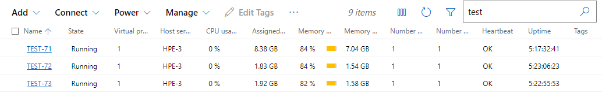

# ABOUT THIS REPO

This repo contain all required files and instructions that consist of :
1. [Step by step how to install jenkins](./installing-jenkins.md)
2. Step by step how to install chef workstation and chef server core
    * [Setting up chef server core and workstation for master node](./installing-chef.md#setting-up-chef-server-core-and-workstation-for-master-node)
    * [Working with cookbooks, recipes, and repositories](./installing-chef.md#working-with-cookbooks-and-repositories)
    * [Setup Chef Nodes (From Chef Manager/Master) And Install Docker To All Node](./installing-chef.md#setup-chef-nodes-from-chef-managermaster-and-install-docker-to-all-node)
    * [Setup Jenkins Docker Plugin Using Chef](./installing-chef.md#setup-jenkins-docker-plugin-using-chef)
    * [Installing Jenkins Slave Container](./installing-chef.md#installing-jenkins-agent-container-using-chef-recipes)
3. [Jenkins Pipeline and step by step how to deploy voting apps in clustered environment](./pipeline-instruction.md)
4. Cookbooks and Recipe to install docker, jenkins agent, jenkins docker plugin [link](./cookbooks/)

---

## REQUIREMENT

We need to create 3 virtual machines with linux installed. In this scenario I will use Ubuntu server 20.04 inside Hyper-v.

    * 1 vcpu
    * Ubuntu server 20.04
    * Storage 50GB
    * RAM 6GB with dynamic RAM mode

Each VM will be named with test-71 (172.18.100.71), test-72 (172.18.100.72), and test-73 (172.18.100.72).

